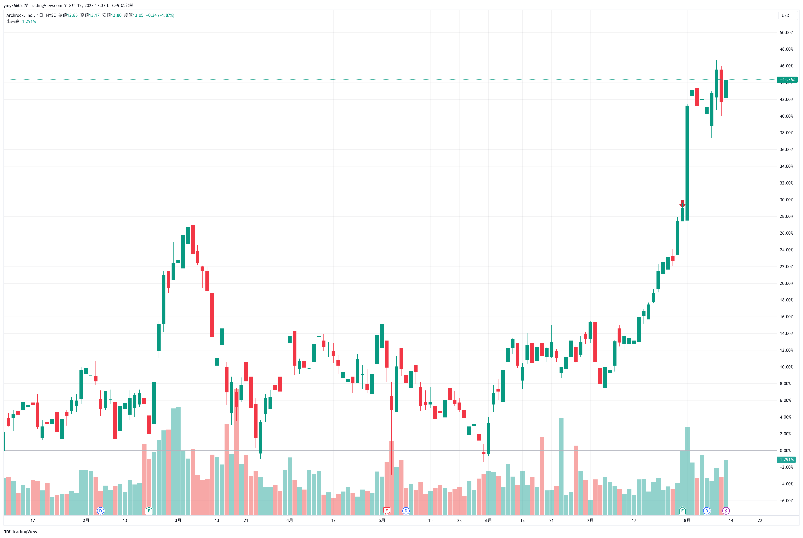
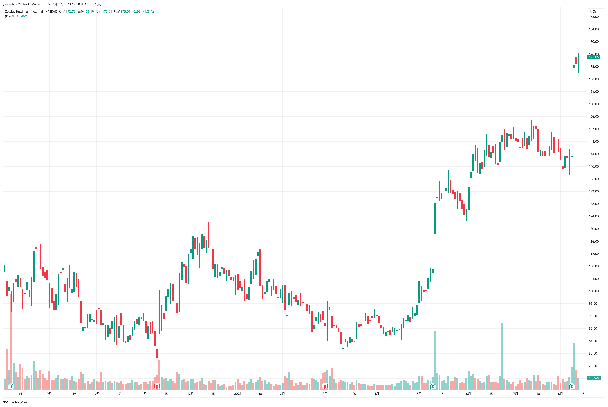
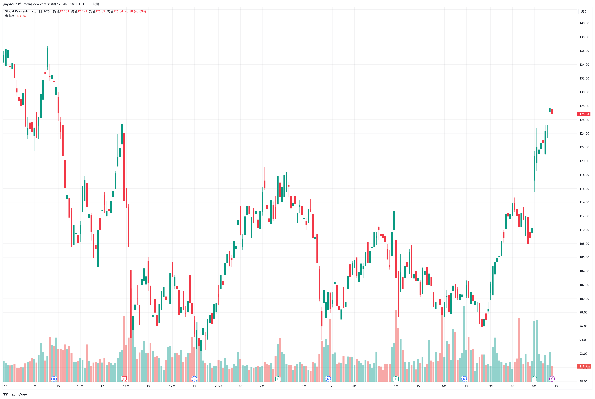
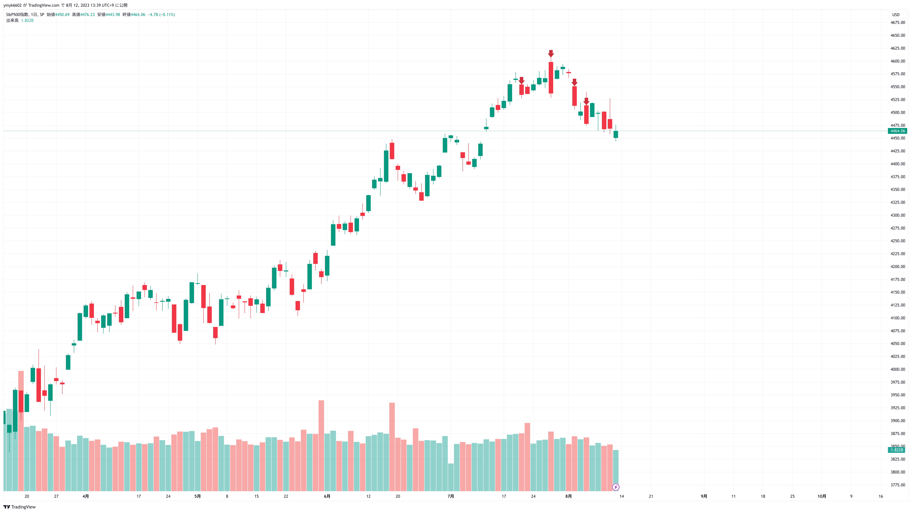
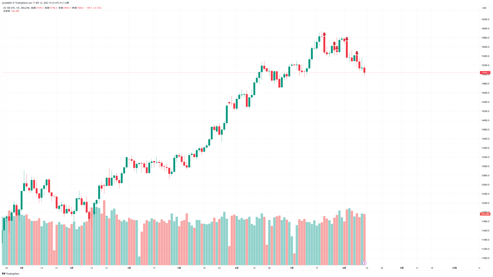
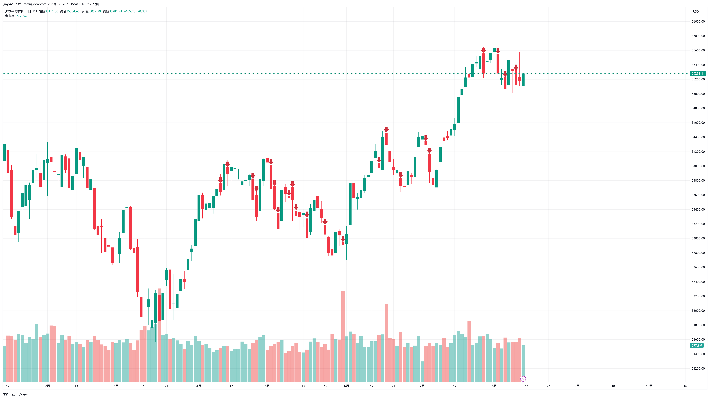

# はじめに
過去の取引を振り返って経験を得られるようにするために、売買日誌と取引履歴をつけることを習慣化していく。
売買日誌はこのブログ上に記録し、売買した銘柄の選定理由や売却理由、市場動向の分析など感じたことなどをメモしておく。
フォーマットはこだわらず、できるだけ毎日継続して書くことを意識する。徐々に形ができてきたらフォーマットを決めることにする。
取引履歴は購入日時、購入価格、売却日時、売却価格、年率換算（単位時間あたり）の利益率を記録する。

# 先週~今週買った株

先週から今週はとりあえずお試しで、新高値をつけた銘柄をいくつか購入した。
決算発表などで大きく値上がりして新高値をつけたものを中心に購入。
急騰の影響で株価がきり下がったり、そのまま揉み合いになるケースが多い気がする。
揉み合い期間が長かったり、典型的なチャートパターンを形成してないかをもっと注視したほうが良いかもしれない。
全体的に買いが遅れているのでもう少し早めに買う必要あり。今は目立って大きく上がってから買ってる。
銘柄選定ももう少し良い方法を考えたい。買うまでに研究する時間が足りない。

## AROC
売上高の伸びはあまりないが、当期利益の予想の伸びが大きく、株価も高値をつけていたので購入。
ただし、タイミングは遅れた。本当は、7/31に大きい出来高で新高値をつけた次の日の寄り付きに成行で購入するのが本来のタイミング。
一日で15%以上上昇するタイミングを逃してしまった。わかりやすい買いシグナルが出ていた。
その前の7/18, 19あたりでもみ合いを抜け出したところも買いで入っても良かったかも
（でもここは新高値更新はしてなかったし、ファンダメンタルズを考えると入りづらいか -> でも何回か跳ね返されてboxを形成していることに注目する必要があったかも）。
とりあえず今はまたもみ合いみたいな感じになっているので、ここを上抜けるかどうかが今週の注目点。
このままもみ合いが続くようなら早めに売却でもいいかも。

<figure>

<figcaption>AROCの日足</figcaption>

</figure>

## CELH
エナジードリンクの新興企業。
これまでのエナジードリンクは健康に悪そうだったが、健康に良いことを標榜している模様。アメリカではかなり人気らしい。
5月の四半期決算のときも大きく株価を大きく切り上げており、サプライズ決算が続いている。
第2ベースか第3ベースにいるので乗り遅れている可能性もあるが、予想利益が良い伸びでファンダメンタルズは良かったので購入。
こちらもこのままもみ合いが続くようなら早めに売却でいいかも。

<figure>

<figcaption>CELHの日足</figcaption>

</figure>

## GPN
この銘柄は52週高値は更新していないが、もみ合いを上抜けしたため購入。
今のところ一番順調に上昇していっている。傾向としても値上がり時に売買高が増えており良い傾向かも。
ただし、ここから前の高値を上回っていけるかが勝負どころと思われる。
超えられないと一気に反落の可能性もあるかも。

<figure>

<figcaption>GPNの日足</figcaption>

</figure>

## IBKR
上場来高値を更新したため購入。
株価は上昇しているが、決算が予想を下回っていたことが気がかり。
テクニカル面は問題ないがファンダメンタルズ面が少し不安かも。
あまり長く持ちすぎないほうが良いかも。

# 売った株

## 積立投資信託

Nasdaqやsp500で機関投資家の売り抜けの兆候が見られたので、積立してきた投信の一部を売却した。
ダウはNasdaqやsp500ほど下落は目立っていない。
特に、レバナスやテック株に連動する投信を多めに売却し、利益を確定させた。
7/20~の売り抜け日がダウは4日、sp500は4日、Nasdaqは5日になっており、売りサインが出ている。
sp500, nasdaqはトレンドラインも割り込んでおり、調整または下落相場へ転換した可能性が高くなってきた。
ただし、どの売り抜け日も取引量は若干多いくらいで、大きく増えているわけではないので、騙しの可能性もある。
ダウ連動投資信託はそのまま、sp500とnasdaq連動の投資信託は今週も持ち高をもう少し減らして様子を見る。

<figure>

<figcaption>S&P500の日足</figcaption>

</figure>

<figure>

<figcaption>NASDAQ 100の日足</figcaption>

</figure>

<figure>

<figcaption>ダウの日足</figcaption>

</figure>

## ドル

1ドル145円の節目が近づいてきたため、ドルの預金を一部円に交換した。
インフレ沈静化が進んでいることから考えると、金利差という観点ではこれ以上大幅な円安が進むとは考えづらい。
今回の円安はリスクオンのドル買いが進んでいることが要因と思われる。これも一時的な動きで大幅な円安は起きないと考える。
ただ、今は良いニュースでも悪いニュースでも円安方向に反応している気がするので、しばらくは円安が進む可能性あり。
現状ドルはあまり必要ないので、急がず円高が進んだところでもう一度ドルを買い直す。

# 今週の注目銘柄

# その他

現金預金がかなり増えてきたのでどこかに投資したいが、上昇相場がこれからも続くかはもう少し様子を見てみないとわからない。
NVIDIAの決算が鍵になると思うので、予想を大幅に上回る決算が出たら上昇相場継続しそう。関連する半導体銘柄に投資するのもあり。

IBDのMarket Smithはあまり使いどころがなさそう。
過去のEPSを多めにチェックできる利点はあるが、それ以外の利点は特にない気がする。
自分でスクレイピングなりしてデータ準備するほうが良い気がする。
一ヶ月で解約する。
